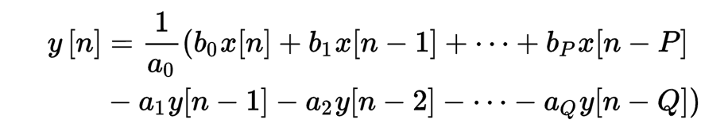
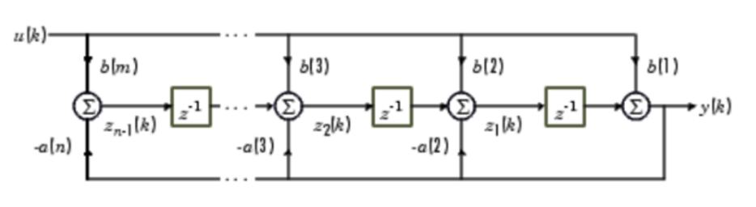
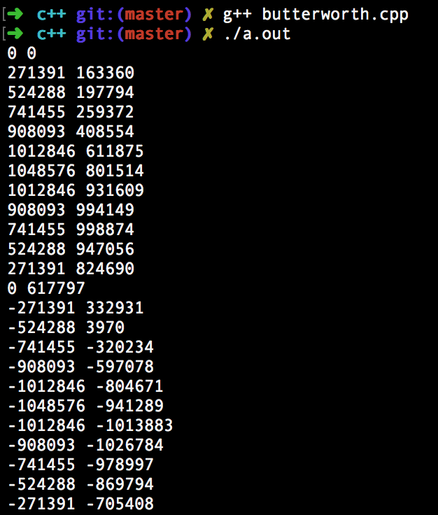
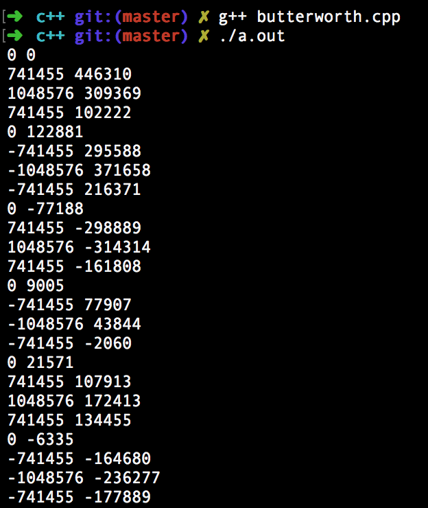

# iir-bandstop-filter

Implementation of pipelined IIR bandstop filter with fixed point arithmetic in Verilog, C++ and MATLAB.

## Basic overview

Bandstop filter blocks the signals which have frequencies in a certain _band_. Here, the sampling frequency is 48kHz and it blocks the signals with frequencies between 5kHz and 7kHz. 5kHz and 7kHz frequencies are also called stopping edges and maximum blocking by the filter occurs at the mean of stopping edges i.e. 6kHz. All other frequencies are passed by the filter.

In IIR filter, current output depends on present input, _N_ past inputs and _N_ past outputs. _N_ is called order of the filter and in this implementation, _N_ = 12. So current output _y[n]_ can be computed by the equation below: 

_ai's_ and _bi's_ are called coefficients of the filter. Coefficients depends on stopping edges and order of the filter. Filter specifications are briefly summarized in the table below: 

Attribute | Value
--- | --- | 
| Order | 12 | 
| Sampling frequency | 48kHz | 
| Stopping edges | 5kHz, 7kHz | 

## Implementation details 

The filter coefficients are calculated by the [MATLAB script](./src/matlab/main.m), following the butterworth characteristics with specifications discussed in the previous section. The obtained filter coefficients are floating point numbers. To implement filter on hardware, we need a digital design where all the numbers should be integers with fixed number of bits. Hence Q-factor scaling has been done, which basically maps the floating point numbers to integers. This process of mapping floating point numbers to integers is also usually called fixed point arithmetic, where we multiply the floating point number by an integer called Q-factor. The result is stored in integer and fractional part is ignored. Q-factor is generally taken as powers of 2 because division and multiplication is just bit shift, which is quite fast on hardware. 

Here, input and output are 32 bit signed integers. Q-factor is 2^20 and intermediate results of multiplications are stored in 64 bit signed integers to avoid any overflows. Two input sinusoidal waves of frequencies 2kHz and 6kHz are generated by MATLAB script and stored in files `data_2k.txt` and `data_6k.txt`. The 2kHz signal should be passed by filter and 6kHz signal should be blocked, as per the specifications. IIR bandstop filter with fixed point arithmetic is implemented in [C++](./src/c++/butterworth.cpp), which takes a data file (`data_2k.txt` or `data_6k.txt`) as input and generates integral outputs for the same. Floating point coefficients are also mapped to integers with Q-factor scaling. Integral output obtained from C++ implementation can be converted back to floating point number by dividing with Q-factor. The float output of C++ implementation almost matches with the output of MATLAB script. 

The IIR filter is finally implemented in [Verilog](./src/verilog/pipelined_iir.v) with integral coefficients generated from the C++ implementation. Following pipelined design has been implemented: 

The Verilog filter is tested on two test benches for frequencies 2kHz and 6kHz. Verification of Verilog implementation is done by simply matching its output with the C++ implementation. For more details, refer to project [report](./report.pdf).

## Results

C++ and verilog implementation outputs for **2kHz** signal.

C++ and verilog implementation outputs for **6kHz** signal.

